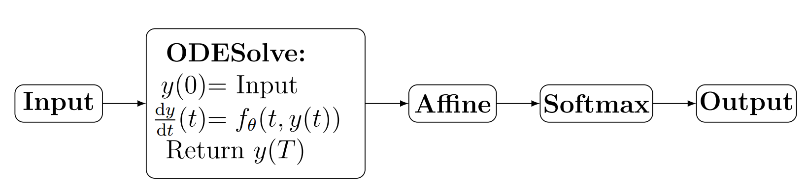

# 1.1.2 到底什么是神经微分方程？

**神经微分方程**是一个使用神经网络来参数化矢量场的微分方程。典型的例子是**神经常微分方程（Neural ODE）**:

$$
y(0)=y_{0} \quad \frac{\mathrm{d} y}{\mathrm{~d} t}(t)=f_{\theta}(t, y(t))
$$

其中$$\theta$$表示某个学习到的参数向量。$$f_\theta$$是任何标准神经结构，$$y$$表示解。对于许多应用，$$f_\theta$$将只是一个简单的前馈网络。

现在的中心思想是将微分方程解算器作为学习的可微分计算图（深度学习中普遍存在的那种计算图）的一部分。

作为一个简单的例子，假设我们观察到一些图片$$y_{0} \in\mathbb{R}^{3\times 32\times 32}$$（RGB和$$32\times 32$$像素），并希望将其分类为一张猫的照片或一张狗的照片。 我们将$$y(0)=y_{0}$$作为神经ODE的初始条件，并将ODE演化到某个时间$$T$$。然后施加一个仿射变换$$\ell_{\theta}: \mathbb{R}^{3 \times 32 \times 32} \rightarrow \mathbb{R}^{2}$$，接着一个softmax函数。这样，输出可以被解释为一个长度为2的元组($$\mathbb{P}$$(猫), $$\mathbb{P}$$(狗))。

整个计算图可以总结为

在传统的数学符号中。 这个计算可以表示为

$$
\operatorname{softmax}\left(\ell_{\theta}\left(y(0)+\int_{0}^{T} f_{\theta}(t, y(t)) \mathrm{d} t\right)\right)
$$

该模型的参数为$$\theta$$。通过随机梯度下降以通常的方式进行训练。我们将在第[5.1节](../../5-shen-jing-wei-fen-fang-cheng-shu-zhi-jie/5.1-chuan-guo-odes-de-fan-xiang-chuan-bo.md)讨论如何对ODE进行反向传播。

那么，总的来说：有一个神经网络$$f_\theta$$，嵌入了关于$$y$$的微分方程，这个微分方程又嵌入了大的一个神经网络（整个计算图）。
